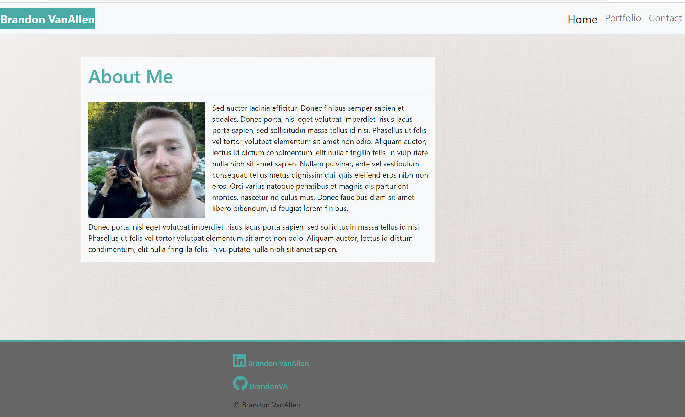

# Week 2 Homework | Responsive-Portfolio

### Table of Contents

- [Description](#Description)
- [Technologies](#Technologies)
- [Contribute](#Contribute)
- [License & copyright](#License)

---

> Project Image.

# Description

The goal of this project was to build a Portfolio that has a responsive design that would work on multiple screen sizes.
The task was build this project using Bootstrap utilizing its grid system (containers, rows, and columns) along with minimizing the use of media queries. The project was required to have three pages 'index.htlm', 'portfolio.html', and 'contact.html' these files needed to have a consistent navbar along with a responsice layout.

# Technologies 

- [Bootstrap](https://getbootstrap.com/)
- [favicon](https://favicon.io/)
- [Font Awsome Icons](https://fontawesome.com/)

# Contribute

Contributing helps the community build better projects. If your want to contribute fork the repo and get started.

# License 

© Brandon VanAllen

